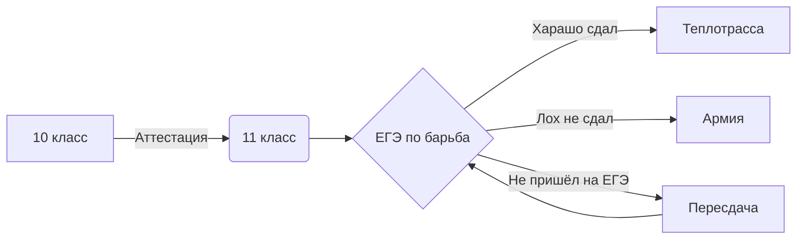

# Работы на уроке информатики
## Выполнил: Стариков Арсений 142 группа
 - Morse.py - Кодировка Морзе python
 - Система счисления.xlsx - Система счисления Excel
 - Система счисления.py - Система счисления python
 - Морзе.xlsx - Кодировка морзе Excel
 - Hem_code.ipynb - Код Хэмминга Jupyter notebook 
 - Нейронка.png - Скриншот Нейронка 
 - Таблица истинности.ods - Таблица истинности и задание с того сайта
 - Logica.py - Задание с того сайта с логикой python
 - kashtak.py - Создание слайд шоу в python
 - victorina.py - викторина в python
## Сайтики
https://codepen.io/murphyqwek/pen/bGMXmez - codepen

https://qweka.wordpress.com/ - вордпрессик

## 14 формула логики

$$A \wedge (A \vee B) = A$$

## Практика LaTeX формулы

.png)

$$\overline{\text{E}^{2}}_{1} = \sqrt{\frac{F\alpha^{x-1}}{(x-1) \cdot x}} + \alpha^{\frac{1}{2}}_{1} + \beta^{\frac{2}{3}}_{1}$$

$$a^{3} + b^{3} = (a+b)(a^{2}+ab+b^{2})$$

$$p_{n} = 1 + \sum_{i=1}^{2^{n}}\left\lfloor \left( \frac{n}{\sum_{j=1}^{i}\left\lfloor \left( \cos\frac{(j-1)! + 1}{j}\pi \right)^{2} \right\rfloor} \right) \right\rfloor^{1/n}$$

## Mermaid

## ЕГЭ
| Граф дорог с таблицей | Таблица истинности | Фильтрация таблиц |
|-----------------------|--------------------|-------------------|
|                       |                    |                   |
